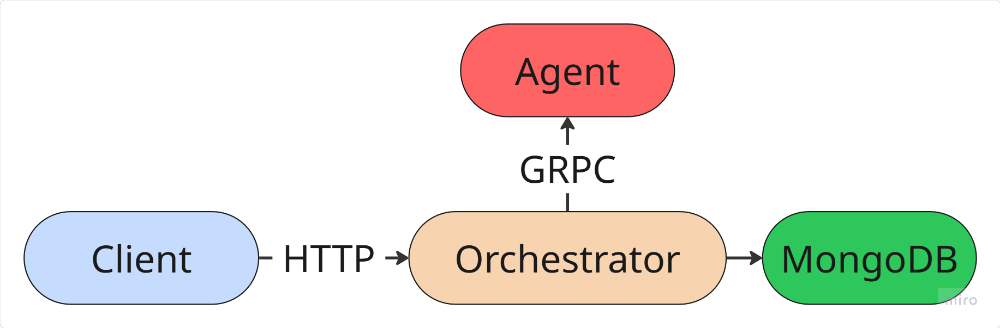

# Calculator

## Intro!

Hi! I'm Vandi, the author of this project! 

You can contact me in [telegram](http://t.me/vandi37) or write an e-mail `lev-person11@yandex.ru`

## Components

### Calculator (Orchestrator)

This is the main service. 

- Manges the external http requests
- Manages tasks with grpc requests in the internal network
- Works with the database for saving state.

### Agent

The agent starts `some` workers that work independently from each other.

- Gets tasks by grpc stream
- Calculates tasks
- Sends back results and error

### Mongo

The database for saving state. I'v chosen mongo because because of its simple and easy to use interface (sql is boring)

- Stores data in 3 collections
    1. Users: User data
    2. Expressions: Expression data, status etc.
    3. Nodes: Expression nodes.

Please don't rate my project lower because of MongoDB. It works and saves the state, so nothing is needed more.



## How to launch the project

Clone the project

```shell
git clone https://github.com/vandi37/Calculator.git
cd Calculator # optional opening directory
code . # optional opening in vscode
```

- The project is working in [docker-compose](https://docs.docker.com/compose/)

### Prepare

You can install docker [here](https://docs.docker.com/get-docker/) 

For being able to run tests install go 1.24.2+ [here](https://golang.org/doc/install)

### Configuration

All configurations are stored in [env](.env)

You can edit some settings if needed, however I recommend you to use the default settings.

### Launch

```shell
docker-compose up
```

It will start building and running the project.

It can take some time so be patient.

## How to use the project

- The project is working on http. If you haven't changed any settings on `http://localhost:8080`

- I will show you example requests and results.

### Creating an account

> Request
> ```shell
> curl --location 'http://localhost:8080/api/v1/register' --header 'Content-Type: application/json' --data '{
>   "username": "your-username",
>   "password": "your-password"
> }'
> ```

> Response
> 201 + `{"id": "your-id"}`

> Errors
> - Invalid body **400**
> - Username taken **409**
> - Invalid password **401**
> - Internal error **500+**

### Login

> Request
> ```shell
> curl --location 'http://localhost:8080/api/v1/login' --header 'Content-Type: application/json' --data '{
>   "username": "your-username",
>   "password": "your-password"
> }'
> ```

> Response
> 200 + `{"token": "your-token"}`

> Errors
> - Invalid body **400**
> - Username not found **404**
> - Wrong password **401**
> - Internal error **500+**

### Calculate

> Request
> ```shell
> curl --location 'http://localhost:8080/api/v1/calculate' --header 'Authorization: your-token' --header 'Content-Type: application/json' --data '{
>    "expression": "your-expression"
> }'
> ```

> Response
> 200 + `{"id": "your-id"}`

> Errors
> - Invalid body **400**
> - Unauthorized **401**
> - Some parsing error **422**

### Get expression

> Request
> ```shell
> curl --location 'http://localhost:8080/api/v1/expressions/your-id' --header 'Authorization: your-token'
> ```

> Response 
>
> 200 + `{"id": "your-id", "origin": "your-expression", "status":"0", "result":"your-result", "created_at":"your-date"}` - Finished
> or `{"id": "your-id", "origin": "your-expression", "status":"1", "error": "your-error", "created_at":"your-date"}` - Error`
> or `{"id": "your-id", "origin": "your-expression", "status":"2", "created_at":"your-date"}` - Pending

> Errors
> - Unauthorized **401**
> - Not found **404**
> - Internal error **500+**

### Get expressions

> Request
> ```shell
> curl --location 'http://localhost:8080/api/v1/expressions' --header 'Authorization: your-token'
> ```

> Response
> 200 + `[...expressions like in get one]`

> Errors
> - Unauthorized **401**
> - Internal error **500+**

### Change username

> Request
> ```shell
> curl --location --request PATCH 'http://localhost:8080/api/v1/username' --header 'Authorization: your-token' --header 'Content-Type: application/json' --data '{
>   "username": "your-new-username"
> }'
> ```

> Response
> 204 (No content)

> Errors
> - Invalid body **400**
> - Unauthorized **401**
> - Username taken **409**
> - Internal error **500+**

### Change password

> Request
> ```shell
> curl --location --request PATCH 'http://localhost:8080/api/v1/password' --header 'Authorization: your-token' --header 'Content-Type: application/json' --data '{
>   "password": "your-new-password"
> }'
> ```

> Response
> 204 (No content)

> Errors
> - Invalid body **400**
> - Unauthorized **401**
> - Invalid password **401**
> - Internal error **500+**

### Delete account

> Request
> ```shell
> curl --location --request DELETE 'http://localhost:8080/api/v1/delete' --header 'Authorization: your-token'
> ```

> Response
> 204 (No content)

> Errors
> - Unauthorized **401**
> - Internal error **500+**

## Running tests

### Agent
```shell
cd agent
go test ./... -cover
cd ..
```

### Orchestrator
```shell
cd calculator
go test ./... -cover
cd ..
```

> The repository tests creates their own docker container with database and deletes them after finishing.

### Integrated

1. Run the app in docker compose
2. Run the tests 
```shell
cd calculator/integration
go test -cover --tags=integration
cd ../..
```

## FAQ

- Where is the unary minus? Does it work? 

    > Yes it works. It is represented as '0 - **expression**''

- Is something like `5`, `-10` and so on an expression

    > Yes! It is because My as tree node can be a binary expression or a number, so 5 it is just a tree with one node.
 