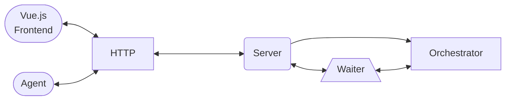
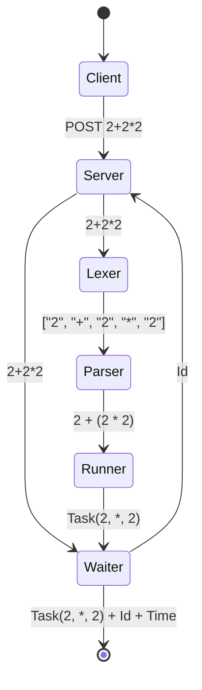
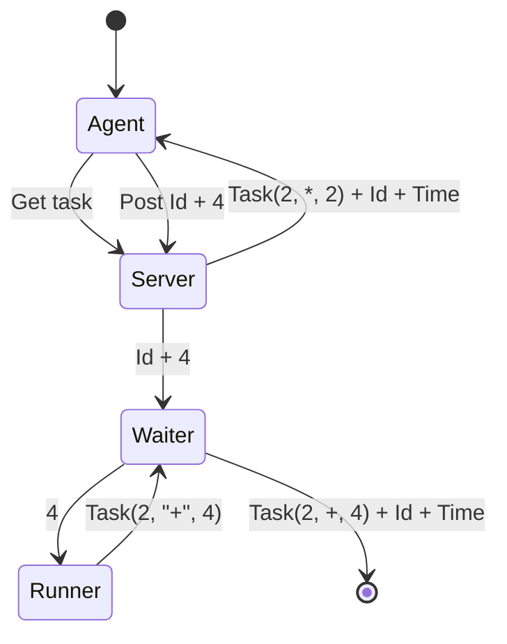
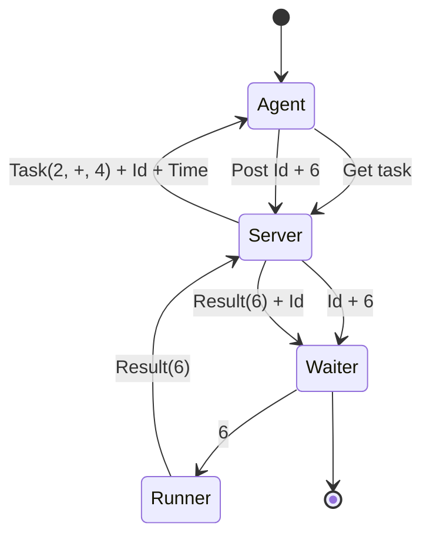
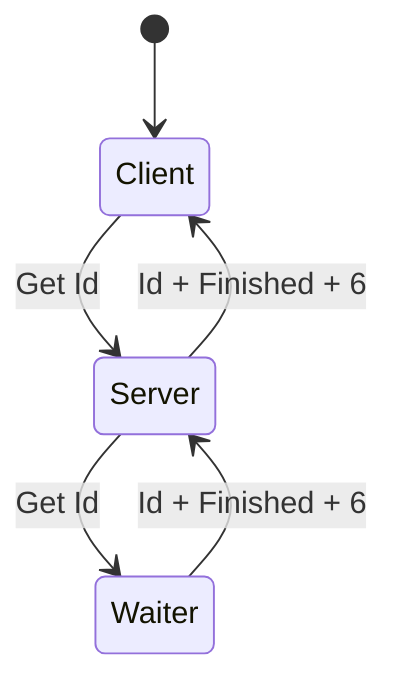

# Concurrent calculator

## Intro!

Hi! I'm Vandi, the author of this project! 

You can contact me in [telegram](http://t.me/vandi37) or [write an e-mail](mailto:lev-person11@yandex.ru)


### What is it? 

This project is a calculator on golang that uses concurrency.

### What does it mean?

The calculator splits the expression into mini tasks and does them outside the main logic.

## Installation and running.

Now, when you know a bit about how it should work and what it is lets talk about installation and running the project.

For the project you need to have installed

1. [git](https://git-scm.com/)
2. [go](https://go.dev/)
3. [node.js & npm](https://nodejs.org/)

### Installing.

1. Download the source code

```shell
git clone https://github.com/vandi37/Calculator.git
cd Calculator
```

2. Install dependencies

```shell
go mod tidy
cd frontend
npm install
cd ..
```

Now the project is ready for running

### Running backend

Backend splits into two parts
1. server
2. agent

You can run them separately 

```shell
go run cmd/server/main.go
```

```shell
go run cmd/agent/main.go
```

or in one process

```shell
go run cmd/group/main.go
```

### Configuration

So there is two ways to configure the program

1. [env](.env)
2. [json](configs/config.json)

Chose a method you like and change config values.

Don't forget to use config type in the program

```shell
go run cmd/... --env 
go run cmd/... --json
```

It will work in all backend running methods

### Running frontend

frontend is configured [here](configs/vue_config.json). Env isn't working in frontend...

```shell
cd frontend
npm run dev
```

After running frontend it will give you a link to the website where the server is.


## Project structure. 



### Server

    The Center of the project. It gets requests and responses on them.

    It calls the `waiter` and `orchestrator` to do operations.

    Endpoints

    1. /api/v1/calculate - send a new expression

	```mermaid
	graph LR

	Client[["Client"]] -----> |"POST Request (Expression)"| Server("Server")

 	Server -----> |"Response (Id)"| Client

	```

    2. /api/v1/expressions - get all expressions
       
	```mermaid
	graph LR

	Client[["Client"]] -----> |"GET Request"| Server("Server")

	Server -----> |"Response (Array of status)"| Client
	```
 
    3. /api/v1/expressions/:id - get expression by id
  
	```mermaid
	graph LR

 	Client[["Client"]] -----> |"GET Request (Id)"| Server("Server")

 	Server -----> |"Response (Status)"| Client
	```
 	
    5. /internal/task - receive a task/send a result of a task

	```mermaid
	graph LR
	
	Client[["Client"]] -----> |"GET Request"| Server("Server")
	
	Server -----> |"Response (Task)"| Client
	```

	 ```mermaid
	graph LR
	
	Client[["Client"]] -----> |"POST Request (Task result)"| Server("Server")
	
	Server -----> |"Response"| Client
	```

### Orchestrator

    It is made from 3 parts

    1. Lexer : Creates tokens from text
    2. Parser : Parses the tokens into a tree.
    3. Runner : Runs goes through the tree and sends tasks to the `waiter`

	 ```mermaid
	graph LR

 	Server("Server") --> |"Expression"| Lexer("Lexer") --> |"Tokens"| Parser(["Parser"]) --> |"Ast"| Runner;

  	Runner <-.-> |"Task 1"| Waiter("Waiter")
  	Runner  <-.->|"Task 2"| Waiter
  	Runner  <-.->|"Task 3"| Waiter 
  	Runner <-.-> |"..."| Waiter
  	Runner <-.-> |"Task N"| Waiter

  	Runner ==> |"Result"| Server
	
  	
	```
 
### Waiter

    It is a program that controls all the expressions and it statuses

    It has this abilities

    1. Add new process (expression)
   
	```mermaid
	graph LR

 	Server("Server") --> |"Expression"| Waiter("Waiter") --> |"Id"| Server
		
	```
    2. Switch status to waiting
   	```mermaid
	graph LR

	Runner --> |"Task"| Waiter("Waiter") --> |"Chanel"| Runner
		
	```
    3. Give a job

  	```mermaid
	graph LR

   	Server("Server") -- "Get task" --> Waiter("Waiter") --> |"Task + Id + Time"| Server

   	```
   	
    4. Receive a job result (*id*, *result*) -> `waiter`
  
   	```mermaid
	graph LR

   	Server("Server") --> |"Id + Result"| Waiter("Waiter")

   	```
    5. Finish a job
  
   	```mermaid
	graph LR

   	Runner --> |"Result"| Server("Server") --> |"Id + Result"| Waiter("Waiter")

   	```
    6. Block a job with an error
  
   	```mermaid
	graph LR

   	Runner --> |"Error"| Server("Server") --> |"Id + Error"| Waiter("Waiter")

   	```
    7. Send all processes (expressions)

   	```mermaid
	graph LR

   	Server("Server") -- "Get all" --> Waiter("Waiter") --> |"Array of status"| Server

   	```
    8. Send a certain process (expression) *id* -> `waiter` -> *status*
  
  	```mermaid
	graph LR

	Server("Server") --> |"Id"| Waiter("Waiter") --> |"Status"| Server

   	```

### Agent

    Gets tasks and does it
	
   ```mermaid
	graph LR

   	Agent(["Agent"]) <-- "GET HTTP <- Task" --> Server("Server")

   	Agent -->  |"POST HTTP Result"| Server

   ```

    There can work many agents at one time

### Frontend on [Vue.js](https://vuejs.org/)

    It has one page.

    1. Send expression
  
   ```mermaid
	graph LR

   	Client(["Client"]) --> |"POST HTTP Expression"| Server("Server")

	Server --> |"HTTP Id"| Client
   ```
    3. View expression history
  
   ```mermaid
	graph LR

   	Client(["Client"]) --> |"GET HTTP"| Server("Server")

	Server --> |"HTTP Array of status"| Client
   ```

### Example

Let say we have an expression "2+2*2".



After that. the agent 



Again the agent



After the client can



What happened here? Client has sent a new expression, server got the expression and gave it to waiter so it can get the id. after the orchestrator parses the expression. When it gets to the first task it sends it to waiter.

After the agent gets the task from the server and calculates it. It sends the server the result. The server sends the result to the waiter which gives it back to the runner. The runner finds the next task. It sends it to the waiter.

Once more the agent receives a task, calculates it and sends back. The result goes through the server, waiter to the runner. The runner realizes that everything is calculated so it gives the result to the waiter.

The client sends a request to the server which asks the waiter about the status of clients expression and gives the status to the client. 

## Examples.

### Errors.

How to make errors?

1. sending expression

```shell
curl --location 'localhost:3701/api/v1/calculate' \
--header 'Content-Type: application/json' \
--data 'not-valid-json'
```

(edit port or path if you have something else in config)

Result: `400 {"error":"invalid body"}`

```shell
curl --location 'localhost:3701/api/v1/calculate' \
--header 'Content-Type: application/json' \
--data '{"expression":"not-valid-expression"}'
```

(edit port or path if you have something else in config)

Result: `422 {"error": "unexpected char"}` Or other errors of parsing

2. Viewing expression 

```shell
curl --location 'localhost:3701/api/v1/expressions/-1'
``` 

(edit port or path if you have something else in config)

Result: `404 {"error": "invalid id"}` 

3. Getting task

```shell
curl --location 'localhost:3701/internal/task'
```

(edit port or path if you have something else in config)

Result: `404 {"error": "no jobs found"}` 

4. Sending task

```shell
curl --location 'localhost:3701/internal/task' \
--header 'Content-Type: application/json' \
--data 'not-valid-json'
```

(edit port or path if you have something else in config)

Result: `400 {"error":"invalid body"}`

```shell
curl --location 'localhost:3701/internal/task' \
--header 'Content-Type: application/json' \
--data '{"id":-1, "result":4}'
```

(edit port or path if you have something else in config)

Result: `404 {"error":"no jobs found"}`

If you send it to a task that is not waiting for a result (for example a finished task)

```shell
curl --location 'localhost:3701/internal/task' \
--header 'Content-Type: application/json' \
--data '{"id":0, "result":4}'
```

(edit port or path if you have something else in config)

Result: `422 {"error":"status is not Processing"}`

Also you can find error with code `500` however it is not reproducible. If you wan't to get it you need to break the server logic

### Ok

I'll show a long expression for some reason.

```shell
curl --location 'localhost:3701/api/v1/calculate' \
--header 'Content-Type: application/json' \
--data '{"expression":"(70/7) * 10 /((3+2) * (3+7)) -2"}'
```

(edit port or path if you have something else in config)

Result: `201 {"id":0}` Id can be different

```shell
curl --location 'localhost:3701/api/v1/expressions'
```

(edit port or path if you have something else in config)

Result: `200 {"expressions":[{"id":0, "expression": "(70/7) * 10 /((3+2) * (3+7)) -2", "status":"Nothing", "value": null}]}` It will depend on what status the expression has.

I used id 0 however be careful to use an existing id

```shell
curl --location 'localhost:3701/api/v1/expressions/0'
```

(edit port or path if you have something else in config)

Result: `200 {"expression" : {"id":0, "expression": "(70/7) * 10 /((3+2) * (3+7)) -2", "status":"Nothing", "value": null}]}` It will depend on what status the expression has.

There should be a task or it wouldn't work

```shell
curl --location 'localhost:3701/internal/task'
```

(edit port or path if you have something else in config)

Result: `200 {"task": {"id": 0, "arg1": 2, "arg2": 2, "operation": 0, "operation_time": 100}}` Example json answer. operation 0 means addition.

I used id 0 however be careful to use an existing id. One more main dependency: it will work only if the process is waiting for a task result

```shell
curl --location 'localhost:3701/internal/task' \
--header 'Content-Type: application/json' \
--data '{"id":0, "result":4}'
```

(edit port or path if you have something else in config)

Result: `200` 

## How the project works inside?

### Tree

```
│   .env
│   .gitignore
│   go.mod
│   go.sum
│   license
│   README.md
│
├───cmd
│   ├───agent
│   │       main.go
│   │
│   ├───group
│   │       main.go
│   │
│   └───server
│           main.go
│
├───configs
│       config.json
│       vue_config.json
│
├───frontend
│   │   .editorconfig
│   │   .prettierrc.json
│   │   eslint.config.js
│   │   index.html
│   │   jsconfig.json
│   │   package-lock.json
│   │   package.json
│   │   README.md
│   │   vite.config.js
│   │
│   ├───public
│   │       favicon.ico
│   │
│   └───src
│       │   App.vue
│       │   main.js
│       │
│       ├───assets
│       │       base.css
│       │       logo.svg
│       │       main.css
│       │
│       └───components
│               HomePage.vue
│
├───internal
│   ├───agent
│   │   ├───do
│   │   │       agent.go
│   │   │
│   │   ├───get
│   │   │       agent.go
│   │   │
│   │   ├───module
│   │   │       agent.go
│   │   │
│   │   └───task
│   │           agent.go
│   │
│   ├───application
│   │       application.go
│   │
│   ├───config
│   │       config.go
│   │
│   ├───ms
│   │       get_ms.go
│   │
│   ├───status
│   │       status.go
│   │       value.go
│   │
│   ├───transport
│   │   ├───handler
│   │   │       errors.go
│   │   │       funcs.go
│   │   │       handler.go
│   │   │       middleware.go
│   │   │
│   │   ├───input
│   │   │       input.go
│   │   │
│   │   ├───resp
│   │   │       resp.go
│   │   │
│   │   └───server
│   │           server.go
│   │
│   └───wait
│           errors.go
│           wait.go
│
├───pkg
│   ├───calc
│   │       calc.go
│   │       errors.go
│   │
│   ├───logger
│   │       setup.go
│   │
│   └───parsing
│       │   info.go
│       │   parsing.go
│       │
│       ├───binding
│       │       binding.go
│       │
│       ├───lexer
│       │       errors.go
│       │       lexer.go
│       │
│       ├───parser
│       │       ast.go
│       │       errors.go
│       │
│       ├───tokens
│       │       tokens.go
│       │
│       └───tree
│               ast.go
│
└───tests
        calc_test.go
        main.go
        wait_test.go
```

### Main folders.

1. [cmd](cmd/). Different logics to run the project.

2. [configs](configs/). Place for configuration files

3. [frontend](frontend/). ([frontend/src](frontend/src/)). All vue.js project. 

4. [internal/agent](internal/agent/). Agent logic

5. [internal/application](internal/application/). Creating app and running it

6. [internal/status](internal/status/). It allow to make and work with statuses of a process

7. [internal/transport](internal/transport/) ([internal/transport/handler](internal/transport/handler/)) Logic if the server.

8. [internal/wait](internal/wait/). The waiter logic.

9. [pkg/calc](pkg/calc/). The logic of the runner

10. [pkg/parsing](pkg/parsing/). The logic of the lexer and parser.

11. [tests](tests/). Tests for the program

### Agent logic.

Let's talk about how the agent works.

At first there are many agents working at the same time. It allows to make long tasks parallel. 

[agent code](internal/agent/get/agent.go)

```go
func RunMultiple(ctx context.Context, num int, ...) {
	path = ...
	for i := 0; i < num; i++ {
        // creating n agents
		go Run(ctx, ...)
	}
	<-ctx.Done()
}
```

sending messages back.

```go
sendBack := func(i int, f float64, r module.Request) {
		buf := bytes.NewBuffer([]byte{})
		// encoding result
        // ...

		resp, err := client.Post(path, "application-json", buf)
		// error handling


		switch resp.StatusCode {
            // logging the result.
		}
	}
```

getting tasks

```go
got, err := client.Get(path)
if err != nil {
// error handling

// Checking that the job found
if got.StatusCode == http.StatusNotFound {
    time.Sleep(time.Millisecond * time.Duration(periodicity))
    continue
}

if got.StatusCode != http.StatusOK {
    // error handling if status isn't ok
}

defer got.Body.Close()

req := new(struct {
    Task module.Request `json:"task"`
})
err = json.NewDecoder(got.Body).Decode(req)
// error handling if status isn't ok

task.Task(req.Task, sendBack) // doing task
time.Sleep(time.Millisecond * time.Duration(periodicity))
```

### Waiter logic 

[waiter](internal/wait/wait.go)

adding a process

```go
func (w *Waiter) Add(expression string) int {
	// mutex

	id := // getting last id

	w.processes[id] = status.New(
        status.Nothing, 
        status.NothingValue{}, 
        expression,
    ) // adding new process
	
	return id
}
```

start waiting

```go
func (w *Waiter) StartWaiting(id int, arg1, arg2 float64, operation tree.ExprSep) (<-chan float64, error) {
	// mutex

	s, ok := w.processes[id] // getting process
	// error handling

	if s.Level != status.Nothing {
		// if status is wrong
	    // error handling
        return ...
	}

	back := make(chan float64) // chanel for sending result back.

	w.processes[id] = status.New(
        status.Waiting, 
        status.WaitingValue{
		    Request: module.Request{
			    // Creating request
		    },
		    Back: back,
	    }, 
        s.Expression,
    ) // editing process status

	w.waiting = append(w.waiting, id) // adding id to waiting so it is faster to find a task
	

	return back, nil
}
```

getting a job

```go
func (w *Waiter) GetJob() (any, bool) {
	// mutex

	if len(w.waiting) <= 0 {
		// if there are no jobs
	    // error handling
        return ...
	}

	id := w.waiting[0] // getting first job in the queue
	s, ok := w.processes[id] // getting the real job
	if !ok || s.Level != status.Waiting {
        // if the job does not exist or it has wrong status
		// error handling
        return ...
	}
	w.waiting = w.waiting[1:] // removing the job

	w.processes[id] = status.New(
        status.Processing, 
        status.ProcessingValue{
            Request: *s.Value.GerRequest(), 
            Back: s.Value.GetBack()
        },
        s.Expression,
    ) // editing status

	return s.Value.ForJson(), true
}
```

finishing a job

```go
func (w *Waiter) FinishJob(id int, result float64) error {
	// mutex

	s, ok := w.processes[id] // getting process
	if !ok {
		// if id is invalid
	    // error handling
        return ...
	}

	if s.Level != status.Processing {
		// if status is wrong
	    // error handling
        return ...
	}

	s.Value.GetBack() <- result // sending result
    close(s.Value.GetBack()) // closing chanel

	w.processes[id] = status.New(
        status.Nothing, 
        status.NothingValue{}, 
        s.Expression,
    ) // editing status

	return nil
}
```

finish a process

```go
func (w *Waiter) Finish(id int, result float64) error {
	// mutex

	s, ok := w.processes[id] // getting process
	if !ok {
		// if id is invalid
	    // error handling
        return ...
	}

	if s.Level != status.Nothing {
		// if status is wrong
	    // error handling
        return ...
	}

	w.processes[id] = status.New(
        status.Finished, 
        status.FinishedValue(result), 
        s.Expression,
    ) // Changing status
	
	return nil
}
```

Blocking process with an error

```go
func (w *Waiter) Error(id int, err error) error {
	// mutex

	s, ok := w.processes[id] // getting process
	if !ok {
		// if id is invalid
	    // error handling
        return ...
	}

	switch s.Level {
	case status.Waiting, status.Processing:
		close(s.Value.GetBack()) // closing chanel
	}

	w.processes[id] = status.New(
        status.Error, 
        status.ErrorValue{Error: err}, 
        s.Expression,
    ) // changing status
	
	return nil
}
```

getting

```go
func (w *Waiter) GetAll() []any {
	all := []any{} // all values

    // making ids in order
	keys := maps.Keys(w.processes)
	slices.Sort(keys) 

	for _, key := range keys {
		all = append(all, w.Get(key)) // adding processes
	}

	return all
}

func (w *Waiter) Exist(id int) bool {
	_, ok := w.processes[id] // Checking the existence
	return ok
}

func (w *Waiter) Get(id int) any {
	s, ok := w.processes[id] // getting the process
	if !ok {
		return nil
	}

	return s.ForJson(id) // format a process to json.
}
```

### Calculator logic

[calculator](pkg/calc/calc.go)

Building ast

```go
func Pre(expression string) (tree.Ast, error) {
    // trimming spaces.
	expression = strings.Replace(expression, " ", "", -1) 

    // getting tokens
	lexer := lexer.New([]rune(expression)) 
	tokens, err := lexer.GetTokens()
	if err != nil {
		return tree.Ast{}, err
	}

    // parsing
	parser := parser.New(tokens)
	return parser.Ast()
}
```

calculating

```go
func Calc(
    ast tree.Ast, 
    send func(
        float64, 
        float64, 
        tree.ExprSep
    ) (<-chan float64, error)) 
    (float64, error) 
{
    // creating a new calculator and running the heights expression
	return New(send).Expression(ast.ExpressionType)
}
```

running expressions

```go
func (c *Calculator) Expression(expression tree.ExpressionType) (float64, error) {
	if expression == nil {
		// checking expression
        return ...
	}

    // If expression is a number it just returns it
	n, ok := expression.(tree.Num)
	if ok {
		return float64(n), nil 
	}

	b, ok := expression.(tree.Expression)
	if !ok {
		// it is an unknown kind of expression
        return ...
	}

    // getting left expression
	left, err := c.Expression(b.Left)
	// error handling

	right, err := c.Expression(b.Right)
	// error handling


	if right == 0 && b.Sep == tree.Division {
		// Checking division by zero
        return ...
	}

    // Sending the expression/
	getter, err := c.send(left, right, b.Sep)
	// error handling

    // Getting a result
	return <-getter, nil
}
```

### Other

I thing that you don't need information how my lexer/parser works. The handler just uses the waiter, so there is nothing interesting.

## FAQ

- Where is the unary minus? Does it work? 

    > Yes it works. It is represented as 0 - **expression**

- Is something like `5`, `-10` and so on an expression

    > Yes! It is because My as tree node can be a binary expression or a number, so 5 it is just a tree with one node.

- Why i haven't used docker-compose?

	> Because i think running 1-3 terminals isn't a problem
	> 
	> I don't have a database or something. my env 
